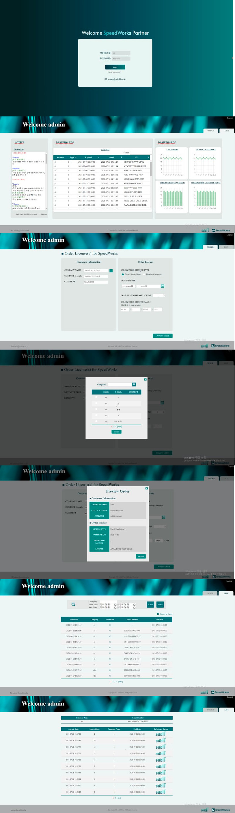
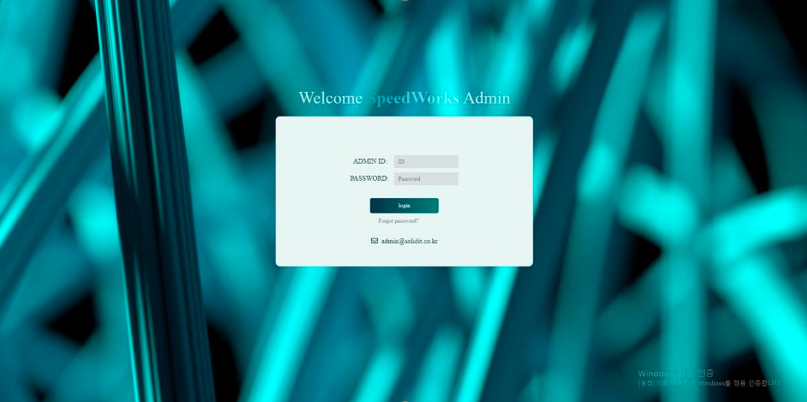
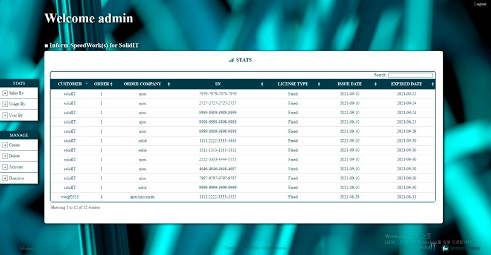
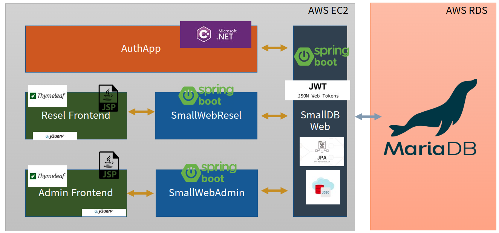

#  :blush: Web for Reseller

## 🖖 개요

    회사 SolidIT에서의 Solid Works 사용을 위한 License 제공은 
    Service Developer –> Service Reseller –> Service Consumer 
    위와 같은 순서로 이루어진다. 
    이때, Developer는 Reseller의 재판매 정책에 대해서 관여하지 않기 때문에 Reseller의 License 주문과 내역, 통계 자료등 Reseller를 위한 서비스를 제공한다.
    
    회원 관리와 상품 관리를 위한 관리자 페이지 또한 만들었다.

## 🖥 인터페이스

   
사용자 페이지
 

   
관리자 페이지
 

## 🏢 시스템 구조

## 🗣 프로젝트 관련 PPT

[백엔드 관련 정리](./Backend/smallweb 서버 정리.pptx)

[프론트 사용자 페이지 관련 정리](./Frontend/SolidWorks_Reseller_Web_Project_심재철.pptx)

[프론트 관리자 페이지 관련 정리](./Frontend/SolidWorks_Admin_Web_Project_심재철.pptx)
